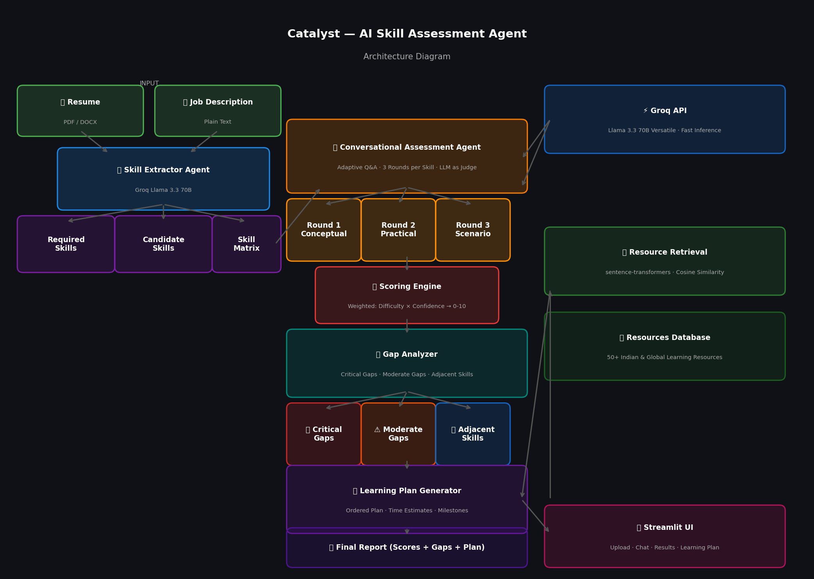

# 🧠 Catalyst — AI Skill Assessment & Personalized Learning Plan Agent

> Built for **Deccan AI Catalyst Hackathon 2026** 

---

## 🔗 Links

* **Live Demo:** https://catalyst-ai-agent-hmb5dx8s9geistt2c4pv5b.streamlit.app/
* **GitHub:** https://github.com/prateekpatel2877/catalyst-ai-agent
* **Demo Video:** https://drive.google.com/file/d/1WDQWKOs6ch5Q2MhOPNteG4rLK3vFKUe9/view?usp=sharing

---

## 🎯 Problem Statement

A resume tells you what someone *claims* to know — not how well they actually know it.

This agent takes a Job Description and a candidate's resume, **conversationally assesses real proficiency** on each required skill, identifies gaps, and generates a **personalized learning plan** with curated resources and time estimates.

---

## 🚀 How It Works

**Input:** Resume (PDF/DOCX) + Job Description
⬇️
**Skill Extractor Agent**

* Extracts required skills from JD
* Extracts claimed skills from Resume
* Builds a skill matrix

⬇️
**Conversational Assessment Agent**

* Generates adaptive questions per skill
* 3 rounds: Conceptual → Practical → Scenario-based
* Adjusts difficulty (easy / medium / hard)
* Scores answers using LLM (0–10)

⬇️
**Gap Analyzer**

* Identifies critical gaps, moderate gaps, and strong skills
* Finds adjacent skills (quick wins based on strengths)

⬇️
**Learning Plan Generator**

* Creates structured roadmap with milestones
* Adds time estimates
* Retrieves resources using semantic search

---

## 🏗️ Architecture

### Tech Stack

| Layer           | Tool                                     |
| --------------- | ---------------------------------------- |
| Frontend        | Streamlit                                |
| LLM             | Groq API — Llama 3.3 70B                 |
| Resume Parsing  | PyMuPDF + python-docx                    |
| Embeddings      | sentence-transformers (all-MiniLM-L6-v2) |
| Resource Search | Cosine similarity                        |
| Deployment      | Streamlit Cloud                          |

---

## 📂 Project Structure

```bash
catalyst/
├── app.py                  # Streamlit main app
├── agents/
│   ├── skill_extractor.py
│   ├── assessor.py
│   ├── gap_analyzer.py
│   └── planner.py
├── utils/
│   ├── resume_parser.py
│   ├── chroma_store.py
│   └── scoring.py
├── prompts/
│   └── templates.py
├── data/
│   └── resources.json
└── requirements.txt
```


---

## 🧠 Scoring Logic

Each skill is evaluated over **3 adaptive rounds**:

| Round | Type       | Difficulty |
| ----- | ---------- | ---------- |
| 1     | Conceptual | Medium     |
| 2     | Practical  | Adaptive   |
| 3     | Scenario   | Adaptive   |

### Formula

```
weighted_score = score × confidence_multiplier × difficulty_weight
```

* Difficulty: easy=0.2, medium=0.5, hard=0.8
* Confidence: low=0.7, medium=1.0, high=1.2

Final score normalized to **0–10**

---

## 📊 Gap Analysis

| Category     | Condition | Action     |
| ------------ | --------- | ---------- |
| Critical Gap | < 5       | Must learn |
| Moderate Gap | 5–6.9     | Improve    |
| Strong Skill | ≥ 7       | Leverage   |

---

## 📚 Resource Retrieval

* Uses **sentence-transformers** embeddings
* Cosine similarity for semantic matching
* Covers:

  * NPTEL, GeeksforGeeks, Analytics Vidhya
  * Coursera, Hugging Face, fast.ai

---

## 🛠️ Local Setup

### Clone repo

```bash
git clone https://github.com/prateekpatel2877/catalyst-ai-agent
cd catalyst-ai-agent
```

### Create environment

```bash
conda create -n catalyst python=3.11 -y
conda activate catalyst
```

### Install dependencies

```bash
pip install -r requirements.txt
```

### Add API key

Create `.env` file:

```
GROQ_API_KEY=your_api_key_here
```

### Run app

```bash
streamlit run app.py
```

---

## 📝 Sample Input

**Resume:** PDF / DOCX

**Job Description:**

* Python
* Machine Learning
* SQL
* Data Analysis
* NLP

---

## 📤 Sample Output

* Python → 9.0 (Expert)

* NLP → 6.0 (Intermediate)

* Gap: NLP (moderate)

* Learning Plan: 8-week roadmap with resources

---

## 🔑 Tools

| Tool                  | Purpose      |
| --------------------- | ------------ |
| Groq API              | LLM          |
| sentence-transformers | Embeddings   |
| Streamlit             | UI           |
| PyMuPDF               | PDF parsing  |
| python-docx           | DOCX parsing |

---

## 👤 Author

**Prateek Patel**

* GitHub: https://github.com/prateekpatel2877
* LinkedIn: https://linkedin.com/in/prateek728
* Email: [prateekpatel2877@gmail.com](mailto:prateekpatel2877@gmail.com)

---

## 🏁 Note

Built in **48 hours (solo)** for Deccan AI Catalyst — focused on solving a **real hiring problem using AI agents**.
